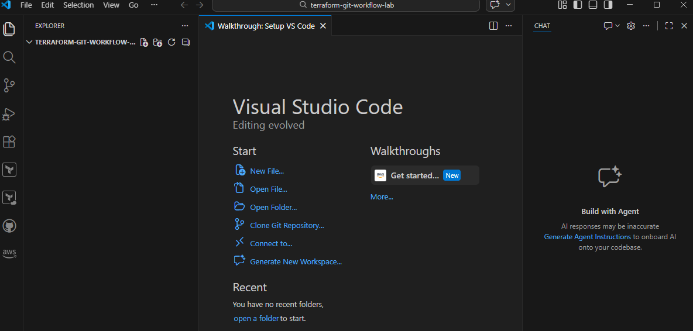
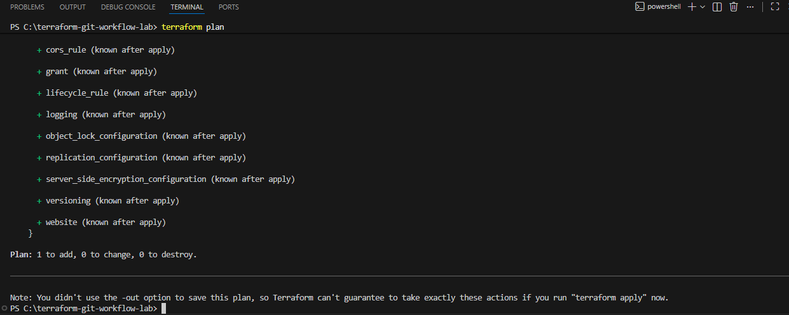
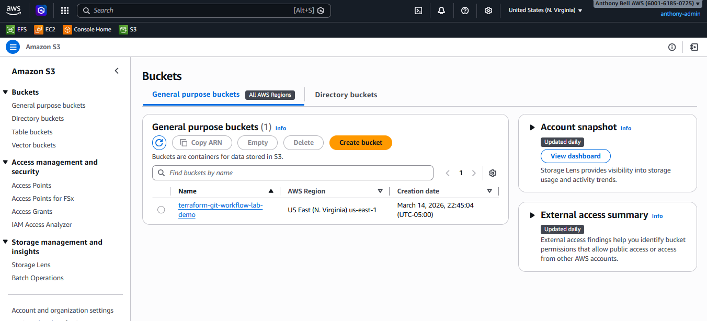

# Terraform Git Workflow Lab

This project demonstrates a basic Terraform infrastructure deployment
managed through a Git workflow.

## Technologies
- Terraform
- AWS S3
- Git
- GitHub
- VS Code

## Infrastructure
This Terraform configuration provisions:
- One Amazon S3 bucket

## Workflow Demonstrated
1. Local Terraform development
2. Version control using Git
3. Infrastructure commit tracking
4. GitHub repository management

## Screenshots

### Terraform Project Structure

### Terraform Plan Output

### S3 Bucket Created

