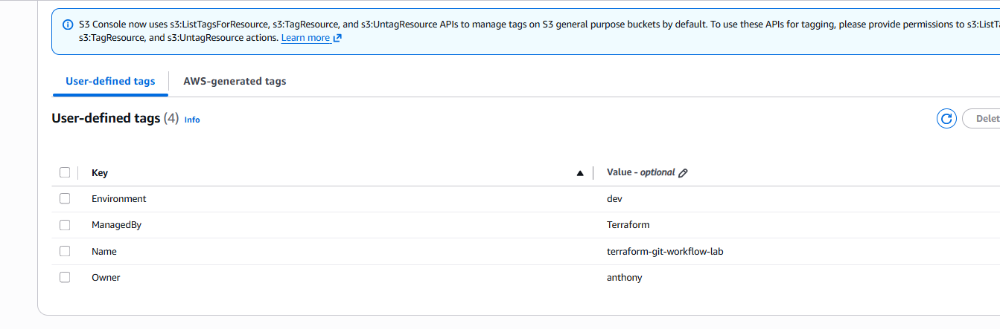

# Terraform Git Workflow Lab

This project demonstrates deploying AWS infrastructure using Terraform and managing the infrastructure code with Git and GitHub.

The goal of this lab was to practice Infrastructure as Code (IaC) concepts and version control workflows commonly used by cloud engineers.

## Tools Used

- AWS
- Terraform
- Git
- GitHub
- Visual Studio Code
- AWS CLI

## Project Overview

In this lab I created a simple Terraform project that provisions an Amazon S3 bucket in AWS.

The Terraform configuration is stored in a Git repository and pushed to GitHub to demonstrate version control of infrastructure code.

## Lab Workflow

The following steps were completed during this lab:

1. Created a Terraform project directory
2. Configured the AWS provider in Terraform
3. Defined an S3 bucket resource in `main.tf`
4. Initialized Terraform using `terraform init`
5. Validated the configuration using `terraform validate`
6. Generated a deployment plan using `terraform plan`
7. Deployed the infrastructure using `terraform apply`
8. Initialized a Git repository
9. Created a `.gitignore` file for Terraform state files
10. Committed the Terraform code
11. Pushed the project to GitHub

## Terraform Best Practice

Terraform state files contain infrastructure metadata and should not be stored in Git repositories.

A `.gitignore` file was created to exclude:

- `.terraform/`
- `*.tfstate`
- `*.tfstate.*`
- `crash.log`

This prevents sensitive or environment-specific files from being uploaded to GitHub.

## Project Structure

terraform-git-workflow-lab  
│  
├── main.tf  
├── .gitignore  
└── images  

## Screenshots

Terraform Project Structure

Terraform Plan Output

S3 Bucket Created

S3 Bucket Tags

## Skills Demonstrated

- Terraform Infrastructure as Code
- AWS resource provisioning
- Git version control
- GitHub repository management
- Terraform project structure
